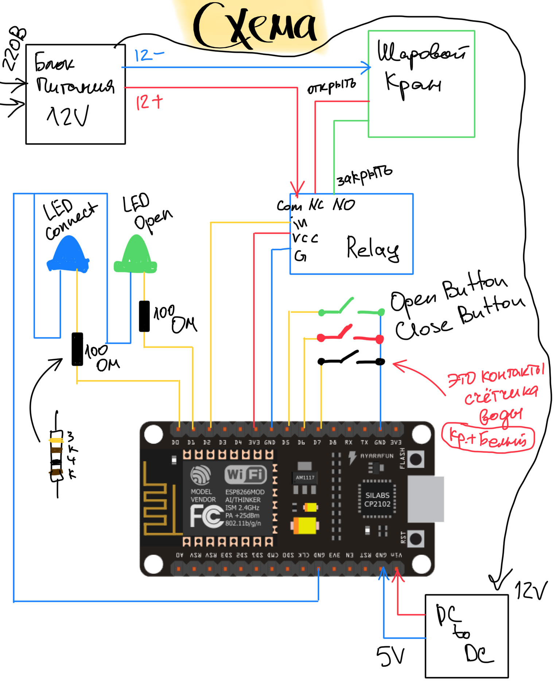

# Прошивка esp8266 для управления краном Neptun по MQTT + Считывание показаний счётчика воды

Сделать блок управления для водяного вентиля и счетчика воды. Должна быть возможность управления вентилем по MQTT из умного дома, а также кнопками на корпусе. Считывать показания счетчика и передавать по MQTT в умный дом.

LED Connect: Когда включается - мигает 1 раз, когда подключается к wi-fi мигает 2 раза, когда подключается к MQTT мигает 3 раза. При передаче MQTT сообщений выключаемся на 100мс

В счетчике воды оказался простой геркон, он срабатывал каждые 10 литров. Текущие показания счетчика хранятся в энергонезависимой памяти моего блока. Каждый раз при срабатывании геркона мы записываем новое значение, а также передаем его в MQTT канал. Этот канал слушает умный дом OpenHAB и обновляет данные в веб-интерфейсе.

Также для счетчика есть отдельный канал управления, в который мы можем передать стартовое показание счетчика, на случай, если водой пользовались, пока не было электричества.

Вентиль воды управляется с помощью одного реле. В обычном состоянии или отключении электричества он всегда открыт. Его можно удаленно закрыть/открыть, отправив команду в MQTT канал. В умном доме добавил переключатель, который позволяет им управлять.

При отключенном питании и при подключении всегда по умолчанию включен NC. Мы можем на него повесить открытое состояние. Как только подали питание 12 воль - в не зависимости от того включилась ли ESP - кран откроется и дома будет вода. Если электричество выключили - вода всё равно есть, потому что приводу для закрытия нужно электричество. Электричество дали - кран включился на открывание. Чтобы открыть по MQTT на пин надо подать LOW.
Чтобы закрыть вентиль - надо включить пин (HIGH), тогда реле переключит питание на NO.

На блоке управления есть 2 светодиода, которые показывают, подключен ли девайс к MQTT и открыта ли вода. Также есть 2 кнопки, которые позволяют открыть/закрыть воду.

Больше фотографий и видео на стнанице проекта: https://dev-and-ride.com/article/blok-kontrolya-vodi-v-kvartire

# Схема подключения

### ВНИМАНИЕ: ИСПОЛЬЗОВАЛ ДРУГОЕ РЕЛЕ - ПРОВОДА NC/NO ПОМЕНЯЛ МЕСТАМИ

    

